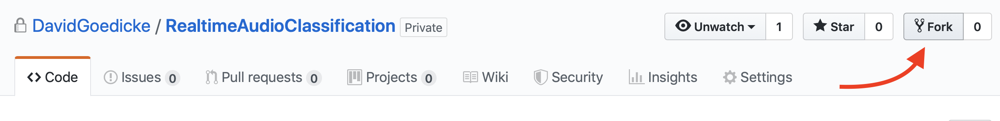

# How To Fork - How To Clone
If you are familiar with the command-line or terminal or git, it might be easier to just clone or fork and then clone the repository. Forking in this case means you create a personal copy of the repository on your GitHub account. Forking is the best option if you want to keep the code on GitHub and will develop it further. 

## Just Clone
0. Install git on your computer. 
		[Linux] (apt-get install git) (Or install Github desktop) 
		[macOs] (brew install git) (Or install Github desktop) 
		[Windows] (I need a link here //TODO:DAVID) (Or install Github desktop)
1. Open the terminal or command-line and navigate with the command ``cd``  to your normal project folder like e.g. the Desktop. The command should look something like this: ``cd ~/Dekstop/``
2. The clone the repository with ``git clone https://github.com/DavidGoedicke/RealtimeAudioClassification.git``
3. If you now navigate into the folder with ``cd RealtimeAudioClassification`` and run ``ls``  you should see the project files like e.g. `00_Setup`, `01_Spectrum Generation`,`02_Training`.

## Fork and then Clone 
0. If you don't have a Github account, create a Github account.
1. [Fork this git repository to your own GitHub.](https://github.com/FAR-Lab/Developing-and-Designing-Interactive-Devices/wiki/Forking-a-GitHub-project)  [More help](https://help.github.com/en/articles/fork-a-repo)
2. Make a folder on your local computer for this workshop, e.g. /Users/LelandJr/NN4A (See step 2 in the above instructions).
2. Clone your forked version of the repository to your local computer workshop directory. With the command ``git clone http://github.com/<<<YourGithubUserName>>>/RealtimeAudioClassification.git`` 
3. If you now navigate into the folder with ``cd RealtimeAudioClassification`` and run ``ls``  you should see the project files like e.g. `00_Setup`, `01_Spectrum Generation`,`02_Training`.

