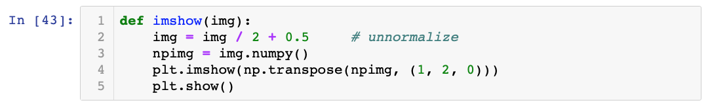

# Join the workshop Discord group, ccrma_nn4a

The invite code for the workshop Discord is: https://discord.gg/Wqz39d

You can either use the online Discord page (https://discordapp.com/) or download the app.

This provides a way for workshop members to share links, ask questions or message one another.

# Getting Set-up
Before we can get started we need to download a few things. First, we need to download the project files we will use for this workshop. The following step by step instruction will guide you through making a git account, forking the repository and cloning it to your computer.

Before we start please make sure that git is installed. There is the [GitHub Desktop](https://desktop.github.com) version and the regular [git](https://git-scm.com/book/en/v2/Getting-Started-Installing-Git).

## Fork and then Clone 
0. Before we start, you need a GitHub account, so please go to [github.com/join](https://github.com/join) and create one if you don't have one yet.
1. Login to your new or existing GitHub account.
2. Navigate to [this repository](https://github.com/DavidGoedicke/RealtimeAudioClassification/) and fork on the fork button in the top right corner.  [More help](https://help.github.com/en/articles/fork-a-repo) This will create your own copy of the repository under your account. 
3. Now open your command line or terminal.
4. Make a folder on your local computer for this workshop. So if you e.g. want to create, a folder called e.g. `NN4A` you would write a function like `mkdir NN4A` and then hit return.
5 Now enter your new folder by typing `cd NN4A`. Change `NN4A` to whatever you named the folder in the previous command.
6. Now clone the forked version of this repository. You can do this with the command ``git clone http://github.com/<<<YourGithubUserName>>>/RealtimeAudioClassification.git`` Remember to replace ``<<<YourGithubUserName>>>`` with your GitHub username. 
7. If you now navigate into the folder with ``cd RealtimeAudioClassification`` and run ``ls`` (``dir`` on Windows)  you should see the project files like e.g. `00_Setup`, `01_Spectrum Generation`, `02_Training`.

For help with the commands, here is a [cheat sheet](https://www.git-tower.com/blog/command-line-cheat-sheet/).

## Installing software tools and libraries
Before we can use these project files, we have to install a few tools and software libraries.

1. [Install Jupyter Notebooks](https://jupyter.readthedocs.io/en/latest/install.html). (Some might already have prepared that)
2. Start Jupyter notebooks in the folder that you cloned to with you downloaded the Git Hub Repository (i.e. in the folder you just downloaded).
3. Within Jupyter, navigate to the folder `00_Setup` and open the Notebook inside. The notebook is called `Setup.ipynb`. 
4. Follow the steps inside that notebook to install and test the software libraries we need for this workshop.

## How to use Jupyter Notebooks
The main ["IDE"](https://en.wikipedia.org/wiki/Integrated_development_environment) that we will be using this week are Jupyter Notebooks. Jupyter Notebooks is great to try out different code snippets to selectively debug the code you are writing.

Everything in these notebooks resolves around cells. The current active cell has a blue or green stripe on the left side. ([Why green or blue? Look here!](https://medium.com/ibm-data-science-experience/back-to-basics-jupyter-notebooks-dfcdc19c54bc)) Normally a cell contains a section of code that is executed together, e.g. We often define each function in its own cell.

You can *edit* the code that is in that cell by clicking into the cell. 

To *run* the code in the cell, you can click on the button on the top that says ` >| Run` or press down `shift + return` at the same time on your keyboard. 

This will run this cell and select the cell below. If you want to run multiple cells in succession, you can press `shift + return` a few times to quickly run the whole notebook.

If you followed the setup steps to [install the packages](https://github.com/DavidGoedicke/RealtimeAudioClassification/wiki/Lab-0.-Setting-up) and [download the data-set](https://github.com/DavidGoedicke/RealtimeAudioClassification/wiki/Lab-0.-Setting-up#download-datasets), then we can proceed in running the relevant code.

## Download datasets
For the first lab, we will use [our very own Cats-Vs-Dogs](Cats-Vs-Dogs) dataset. We will be distributing this dataset in person directly, through [Dropbox](https://www.dropbox.com/sh/pgy6tn4ugbfag0j/AADuiHrW-XgbwCDqiKUrMQ6Na?dl=0), USB-stick or AirDrop. 

When these datasets are finished downloading or copying to the computer, unzip and move them to the ``AudioData/`` folder in your workshop repository folder. Any Dataset you might want to train on later should go in there to make the use of the existing scripts easy. 