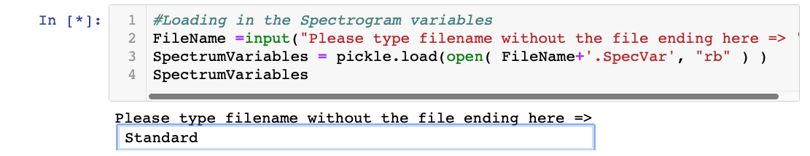
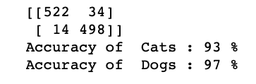

## The Cats vs. Dogs dataset
Let us look at the files in the audio data set folders we [previously downloaded](https://github.com/DavidGoedicke/RealtimeAudioClassification/wiki/Lab-0.-Setting-up#download-datasets).

### The Data
The Cats-Vs-Dogs dataset is a simple audio at a set that has two classes, sounds of cats meowing and of dogs barking. The data was created to have an easy binary example of how classification can work. The data set is a bout 1.5Gb large and has samples of varying length. The samples are all wav files with at least 16bit and at least 44.1 kHz sampling rate. Most will have a sampling rate of 48 kHz and a bit depth off 24bit.


While the bit depth is not as important (noise is a good thing for neural nets) the sampling rate is very important. The higher the [niquist frequency](wikipedia.org) the more information can be displayed in the Spectrogram.

### Collection

This data set was collected from [freesound.org](freesound.org). Most of the sounds are under public license and have been recorded on very different audio gear, in different contexts etc. 

### Data Structure
We define classes of data by folders--that is, data that should be classified similarly are put in the same file folder. If you later want to change the types of thing you want to distinguish, you just change the data file in the folders.

For Cats vs. Dogs, the data folders look like this:
``` shell
AudioData/
└── Cats-Vs-Dogs
    ├── Cats
    └── Dogs
````

Take a little time to look at the number of files, and look at some of the files. How many files are there? How big are they? Are they tightly clipped around barks and meows?

## Generating Spectrums
One of the field neural networks in their current form are very good at are detecting images. The convolutional Neural Networks (CNNs) that are being used for image recognition have become almost ubiquitous and are therefore very easy to play with. 

Ironically, then, one of the best ways to perform classification of audio data convert our audio into spectrograms, which is essentially an image representation of a little audio snippet. After we generate these audio-images, we can retrain any standard image classifier to work with our images and help us classify our audio data. 

So! the first step is to compute images from the audio data.

We prepared the notebook `GeneratingSpectrums` in the `01_Spectrum Generation` folder for this task. 

Here is an example of how to run the notebook from the Mac Terminal command-line:

```` shell
$ ls
00_Setup		03_Running
01_Spectrum Generation	README.md
02_Training		doc
$ cd 01_Spectrum\ Generation/
$ ls
GeneratingSpectrums.ipynb	SpectrumsSettingsTool.ipynb
GeneratingSpectrums_edit.ipynb	Standard.SpecVar
$ jupyter notebook GeneratingSpectrums.ipynb 
````
Other ways of launching the GeneratingSpectrums notebook will be demonstrated in lecture.

Run the first two cells,  which load libraries and define folder paths, by making sure that the first one is selected (remember the green or blue line on the left side mean *edit* or *command*) and press `shift+return` twice. 

It might take a while but you should see the number in the top left corner, next to the cell change from empty to a star to a number. Something like this 
```python
In []: # This code block has not been executed.

In [*]: # This code is being executed but has not finished. 

In [1]: #This code block is finished and was the first one to finish. 
```

Now, run the 3rd cell,  which loads the Spectrum Variables file. A text box should appear asking you to "Please type filename without the file ending here". 

In the textbox, type in ``Standard`` and press return to designate that the `Standard.SpecVar` file in the local folder should be used.  (What the different variables mean, and how to change it is covered in Lab 2.) 



Press run (or `shift+return`) to run all the other cells on the page.

To check if it's done, look at the `In [*]:` box in the top left corner of the cell. If it turns into a number, it is finished. The last step will take several minutes, and may generate warning messages even if everything is working.

By the end of this step, we have images made of all of the sounds in main folder.

## Training the Neural Network

We will be using a the [ResNet CNN](https://www.mathworks.com/help/deeplearning/ref/resnet18.html), which was pretrained. on more than a million images from the ImageNet database. Basically, this is a generic CNN that has been trained to "see," and we retrain the last layer of the network to find differences in the Spectrograms.

Please open the notebook `TrainingResNet` in the folder `02_Training`. (See the previous set for an example of how to run a Jupiter Notebook.)

### Start the Notebook running
Try to run the whole notebook, either by clicking `Run` a couple of times or by clicking on the menu item `Cell` and selecting `Run All`. The complete execution will probably take a while. It can up to 30 minutes depending on your computers speed number of cores. 

### Look at the code in the Notebook
While the code is running, we have take some time to go through the notebook and understand what is going on.

Here are a few interesting sections to look at.


**Parameters**

Just like in the previous step, we define the important parameters for training the network at the beginning.

By leaving the variable `SPECTRUM_IMAGES_CLASSES_TEST` empty we create automatically a test and training data set with a 80%/20% ratio split. 
```python
SPECTRUM_IMAGES_CLASSES_TRAIN = '../GeneratedData/Cats-Vs-Dogs/'
SPECTRUM_IMAGES_CLASSES_TEST = ''
INPUT_RESOLUTION = 224
```
The following section then loads the data from the specified folder and looks for the classes of the data based on the sub-folders. The script reports the classes it found and if it used an 80%/20% split or not.

```shell
Using one data set and separating them with an 80%/20% split
['Cats', 'Dogs']
```

The **Preview sample training images** cells takes an entire training batch of images and displays them with their respective labels. Have a look and verify that indeed you see spectrograph images that look similar to what you saw earlier.


The **Training the network** cell is the main cell which will take the longest to compute (5-10 minutes) and actually trains the network. 

The **Post training analytics** cells then assess the performance of the newly trained neural network.

In the '# Print predicted and acual labels for Spectragrams' cell, we load a batch of images and display both the ground truth and the predicted value. This is super valuable to look at as you can sometimes issue especially when the network consistently classifies something wrong.

The '# Network analytics' cell runs the complete test dataset through the algorithm, produces a confusion matrix and calculates accuracies. When this notebook is done, you should see values like this.



## Running the Neural Net
This is also known as inference. 

In this step, we basically put the neural net to a real-world test. We let the network infer from the incoming audio which class its thinks is the best fit.

This involves creating an audio buffer that we continually update with information from the microphone, then creating an image and running it through the neural net. This happens as fast as possible over and over again.

The underlying Python code is a bit more complex; Lab 3 will address the details on that. For now, we have a simple Jupyter Notebook that just lets us test our network. So, please open the notebook `ResNetInference` in the folder `03_Running`. 

When you run the first two cells you will see that the program will run for 30 seconds and display the most relevant class in the output window.

```python
RTA.RunProgram(targetLength=30,k=1)
```
You can run the second cell over and over again. Better, however, is to change the ``targetLength=`` variable to something higher e.g. ``targetLength=60`` for a one minute run(if you enter 0 the program will never stop). If you want to see more the second or third most likely class prediction increase the k value. In our case with Cats-Vs-Dogs, the highest meaningful value is 2, as we only have 2 classes. 

## Explore the data

It helps to get an intuitive feeling for how the sounds get translated to spectrograms. Use `SpectrumsSettingsTool.inpy` from the `01_Spectrum Generation` folder to explore the mapping between the sound and the image of the spectrograms.


## Develop your own Binary classification task

Using online datasets such as [Kaggle](https://www.kaggle.com/tags/audio-data), [AudioSet](https://research.google.com/audioset/), [Freesound](https://datasets.freesound.org/fsd/) and [Mivia](https://mivia.unisa.it/datasets/audio-analysis/mivia-audio-events/), (and others!) find sounds to create your own audio classification task. Target having ~125 samples of each of two categories. 
 
[Converting CSV labelled dataset to folders](https://github.com/DavidGoedicke/RealtimeAudioClassification/wiki/Converting-CSV-datasets-into-folders)

[Sharing/Exporting your model](https://github.com/DavidGoedicke/RealtimeAudioClassification/wiki/Sharing-your-results)

[Making a Audio Dataset from a Video Dataset](https://github.com/DavidGoedicke/RealtimeAudioClassification/wiki/Making-audio-dataset-from-a-video-dataset)

Modify the Cats vs. Dog python notebook inputs to try out your own classification! What works better? What doesn't work as well? Post your learnings on the workshop Discord!

## Bonus task: Check out the computer vision version of Cats vs. Dogs!

This is the canonical tutorial of the basic binary classification tasks: https://towardsdatascience.com/image-classifier-cats-vs-dogs-with-convolutional-neural-networks-cnns-and-google-colabs-4e9af21ae7a8