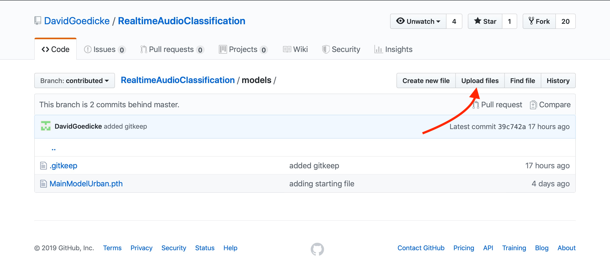

## Saving the model

One of the most important aspects of training a neural network is **saving the trained model**. This part of the script is already implemented and runs each time you run the `TrainingResNet` python notebook. 

It is the following code section that is performing the task.
```python
SpectrumVariables = pickle.load(open(os.path.join(SPECTRUM_IMAGES_CLASSES_TRAIN,'Main.SpecVar'), "rb" ) )
torch.save({
    'model':model.state_dict(),
    'classes':classes,
    'resolution':INPUT_RESOLUTION,
    'SpectrumVariables':SpectrumVariables,
    'modelType':"resnet18" # <= If you try out different models make sure to change this too
},"../models/CatDogResNet.pth") # <=Edit file name here 
```

First of all, you can go and visit the models you've built in the `RealtimeAudioClassification/models` folder.

Also, if you changed your model by e.g. training on different classes then before, you should change the file name at the very end of this block of python code. For example, if you trained the model to now distinguish birds and cats you might want to change the file name to
```python "../models/CatDogResNet.pth" =>"../models/CatBirdsResNet.pth" ``` before running the cell.
This will create a file that you or anyone else can use in the `ResNetInference` notebook from the `03_Running` folder.

## Adding the file to the workshop GitHub repository

You can upload the .pth files for your model (ideally with ample description) to the `contributed/` brach of the workshop GitHub repository. We will review these and merge them into the master repository!

https://github.com/DavidGoedicke/RealtimeAudioClassification/tree/contributed/models 

